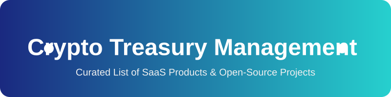

  

  
  

# 🚀 Awesome Crypto Treasury Management

> **An SEO-friendly, curated list of the best SaaS products and open-source GitHub projects for Crypto Treasury Management.** Discover multi-sig wallets, on-chain operations, crypto accounting, policy controls, payments, and institutional custody tools. 

## 🏆 Top Crypto Treasury Management Tools Ecosystem
**Curated List of SaaS Products & Open-Source GitHub Projects** 🌐
*Focused on Multi-Sig Wallets, On-Chain Treasury Operations, Crypto Accounting, Policy Controls, Payments & Institutional Custody* 💼
**Last updated: August 2026** 📅

This repository tracks notable **SaaS platforms** and **open-source projects** for **Crypto Treasury Management**. These tools help DAOs, protocols, companies, and institutions securely hold, move, account for, and govern digital assets using multi-signature controls, policy engines, transaction simulation, reporting, and integrations with DeFi and traditional finance systems. 🏦🔐

**Examples** include Coinshift, Request Finance, Bitwave, Cryptio, Integral, Fordefi, Fireblocks, Safe, Mesh, and Parfin (the category leaders and widely used platforms).

**Open-source emphasis**: This section is heavily expanded with every major active project for self-custody multi-sig infrastructure, DAO treasury tooling, on-chain reporting, Bitcoin collaborative custody, and transparent policy-based operations — ideal for DAOs, protocols, crypto-native companies, and organizations that prioritize verifiability, self-hosting, and freedom from custodial lock-in. 🔓

Contributions welcome! Open a PR to add/update entries. Keep descriptions factual and link to official sites / GitHub repos. 🤝

## 📑 Table of Contents
- [SaaS/Hosted Platforms](#saas-hosted-platforms)
- [Open-Source GitHub Projects](#open-source-github-projects)
- [How to Contribute](#how-to-contribute)
- [Disclaimer](#disclaimer)

## 🏢 SaaS/Hosted Platforms

| Platform | Description | Pricing | Free Tier Limits | Size (Valuation/Funding) |
|----------|-------------|---------|------------------|--------------------------|
| **[Fireblocks](https://www.fireblocks.com/)** | Leading enterprise digital asset platform using MPC custody, policy controls, network connectivity, and treasury workflows for institutions. | Starts around $999/month (Essentials plan) | Developer Sandbox (Testnet only) | $8B Valuation |
| **[Mesh](https://www.meshconnect.com/)** | Connectivity and payments infrastructure that helps move and manage crypto assets across platforms and institutions. | Enterprise Quote Required | Free Sandbox environment | $1B Valuation |
| **[Safe](https://safe.global/)** (commercial services & ecosystem) | The dominant smart account / multi-sig infrastructure (with enterprise tooling and apps built on top) widely used for organizational treasuries. | Free for core contracts; API from €199/month | 50K API calls/month (Builder tier) | ~$1B Valuation / $100M+ Funding |
| **[Fordefi](https://www.fordefi.com/)** | Institutional self-custody platform with MPC, policy engine, transaction simulation, and multi-chain support for secure treasury operations. | Enterprise Quote Required | No free trial; demo only | >$100M Valuation |
| **[Cryptio](https://cryptio.co/)** | Institutional-grade crypto accounting and treasury platform with automated bookkeeping, audit trails, and ERP integrations. | Starts around $449/month (estimated) | No free trial; demo only | $71M+ Funding |
| **[Squads](https://squads.so/)** (protocol + commercial) | Leading multi-sig and treasury management solution for the Solana ecosystem. | Starts at $49/month (Business Plan) | Network fees only for core usage | $42.9M Funding |
| **[Parfin](https://www.parfin.io/)** | Institutional digital asset platform offering custody, trading, and treasury management solutions, particularly strong in certain regions. | Enterprise Quote Required | No free trial; demo only | $38M Funding |
| **[Bitwave](https://www.bitwave.io/)** | Enterprise crypto accounting, tax, and treasury operations platform focused on compliance, reconciliation, and financial reporting. | Enterprise Quote Required | No free trial; demo only | $22.3M Funding |
| **[Coinshift](https://coinshift.xyz/)** | Treasury management platform built on Safe infrastructure, offering multi-sig operations, spending policies, accounting, and team collaboration features for crypto organizations. | Enterprise Quote Required | No free trial; demo only | $17.5M Funding |
| **[Integral](https://integral.xyz/)** | On-chain treasury and DeFi operations platform providing portfolio management, execution, and risk tools for crypto treasuries. | Enterprise Quote Required | No free trial; demo only | $8.5M Funding |
| **[Den](https://www.den.finance/)** | Treasury operations layer built on Safe, providing advanced transaction simulation, accounting, signer coordination, and policy tools. | Free to use (Network fees apply) | Network gas fees only | $7.3M Funding |
| **[Request Finance](https://www.request.finance/)** | Crypto invoicing, payroll, expenses, and accounting platform that supports multi-chain payments and integrates with treasury workflows. | Starts at $300/month | Free plan for freelancers/contractors; 30-day free trial for paid plans | $5.5M+ Funding |

## 💻 Open-Source GitHub Projects
- **[Snapshot](https://github.com/snapshot-labs)**   
  Leading open-source off-chain governance platform frequently paired with Safe for proposal → voting → on-chain treasury execution workflows (via Zodiac Reality Module / SafeSnap patterns). 🗳️
- **[Safe](https://github.com/safe-global)** (formerly Gnosis Safe)   
  The foundational open-source smart account and multi-signature protocol securing tens of billions in assets. Modular, programmable, heavily audited, and the de-facto standard for DAO and organizational treasuries on EVM chains. Fully self-custodial and composable with Zodiac modules. 🛡️
- **[Aragon](https://github.com/aragon)**   
  One of the oldest and most established frameworks for DAO creation and treasury management on Ethereum, providing comprehensive modular governance solutions. 🏛️
- **[Zodiac](https://github.com/gnosis/zodiac)** (and related modules)   
  Open modular framework that extends Safe with roles, delays, reality modules, and other powerful treasury governance primitives. 🧩
- **[Bitcoin Keeper](https://bitcoinkeeper.app/)** / **[Liana](https://github.com/wizardsardine/liana)**   
  Open-source Bitcoin multisig and miniscript-based wallets focused on collaborative custody, inheritance, timelocks, and robust long-term treasury security. ₿
- **[DAO DAO](https://github.com/DA0-DA0)**   
  Leading DAO and treasury management infrastructure in the Cosmos ecosystem, supporting powerful interchain treasury commands and CosmWasm smart contracts. ⚛️
- **[Caravan](https://github.com/unchained-capital/caravan)** (Unchained)   
  Stateless, open-source Bitcoin multi-sig coordination tool designed for collaborative custody, recovery, and long-term self-custody without relying on a single vendor. 🔐
- **[Squads Protocol](https://github.com/Squads-Protocol)**   
  Open-source multi-sig and treasury management infrastructure for Solana, widely used by teams and protocols for secure collaborative control of assets. ☀️
- **[nearvault](https://github.com/PierreLeGuen/nearvault)**   
  Open-source treasury management dashboard for NEAR teams, supporting multisig approvals, payments, staking, lockups, and DeFi interactions in a clean web interface. 🗄️
- **[Mesh Multisig](https://github.com/MeshJS/multisig)**   
  Open-source multi-signature wallet solution for Cardano, enabling teams and DAOs to manage treasury funds and participate in governance securely. ₳
- **[dao-treasury](https://github.com/BobTheBuidler/dao-treasury)**   
  Open-source financial reporting and treasury management extension for decentralized organizations, providing automated data collection, Grafana dashboards, and transparent on-chain reporting. 📊

### ➕ Additional Strong Open-Source Options
- Community reporting and analytics tools for on-chain treasuries (various portfolio exporters and Grafana-based dashboards).
- Open-source MPC and threshold signature libraries that can underpin custom custody solutions.
- Self-hosted accounting and reconciliation scripts that pull on-chain data into double-entry systems.
- Emerging AI-assisted treasury monitoring and execution frameworks that remain non-custodial and require explicit human approval.
- Bitcoin collaborative custody stacks combining Caravan, hardware wallets, and open coordination layers.

**Frameworks for building custom systems**: Combine **Safe** (or Squads on Solana) as the core multi-sig / smart account layer, **Zodiac** modules for advanced policies and automation, **Snapshot** for governance, open reporting tools (**dao-treasury** style), and self-hosted dashboards for a fully transparent, auditable, and vendor-independent crypto treasury stack. 🏗️

## 🤝 How to Contribute
1. Fork the repo.
2. Add/edit entries in `README.md` (follow existing format).
3. Include: name, link, 1–2 sentence description, and whether it's SaaS or open-source.
4. Submit PR with a short explanation.

⭐ Star the repo if you find it useful!

## ⚠️ Disclaimer
- This is a **community-curated** list — not exhaustive and not an endorsement.
- Crypto treasury tools involve significant security, operational, and regulatory risk. Always perform independent audits, use hardware security modules or proven multi-sig setups, maintain proper key ceremonies, and comply with applicable regulations (including travel rule, sanctions, and accounting standards).
- Self-hosted and open-source solutions require strong operational security, key management discipline, and continuous monitoring.
---
**Made for DAO operators, protocol treasurers, crypto-native finance teams, and anyone who wants secure, transparent, and self-sovereign digital asset treasury management.** 💎
Let's make crypto treasury operations more open, verifiable, and free from single points of failure or vendor lock-in. 🌍

## 📈 Star History

